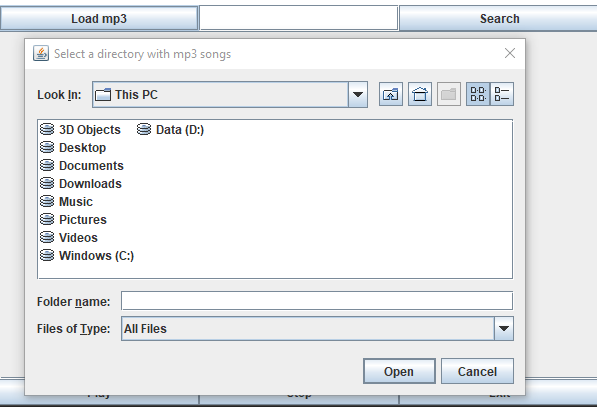
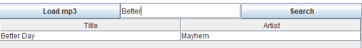

# MP3 Playing Software

## Description
A simple MP3 software made with Core Java, JAudioTagger, and Java Swing. The program allows the user to load a list a of songs into the software and then select which songs to play. Additionally, users can search for specific songs. The program is multi-threaded to allow for song searching, playing, and file browsing/loading to happen at any time. 

## Design

## Features
The MP3 Software contains a few basic features:
1) Load MP3 Files into the software - The load button allows a user to choose a directory to import music from.  

2) Search functionality - Once a list of songs is loaded in, the user can search for a specific songs  using the search box. The software will search for any song name that starts with the word(s) that the user typed.  

3) Play - This button plays the chosen MP3  

4) Stop - This stops the current song that is playing  

5) Exit - Exits the program  

## Limitations
Currently, this only works on MP3 files.

## Resources
